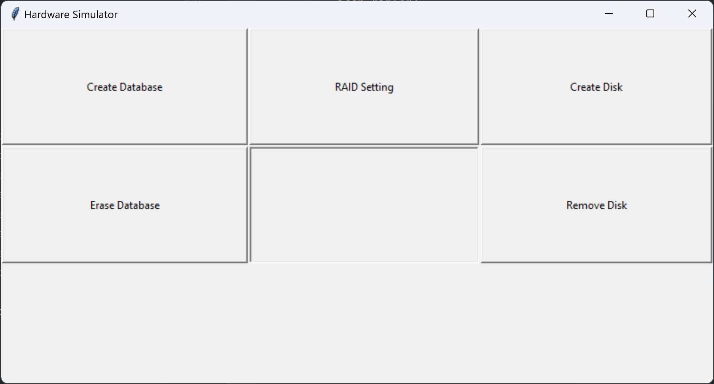
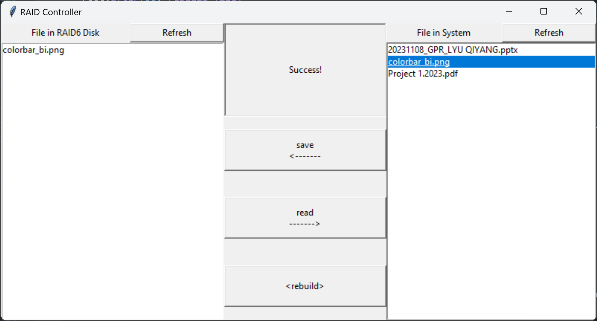
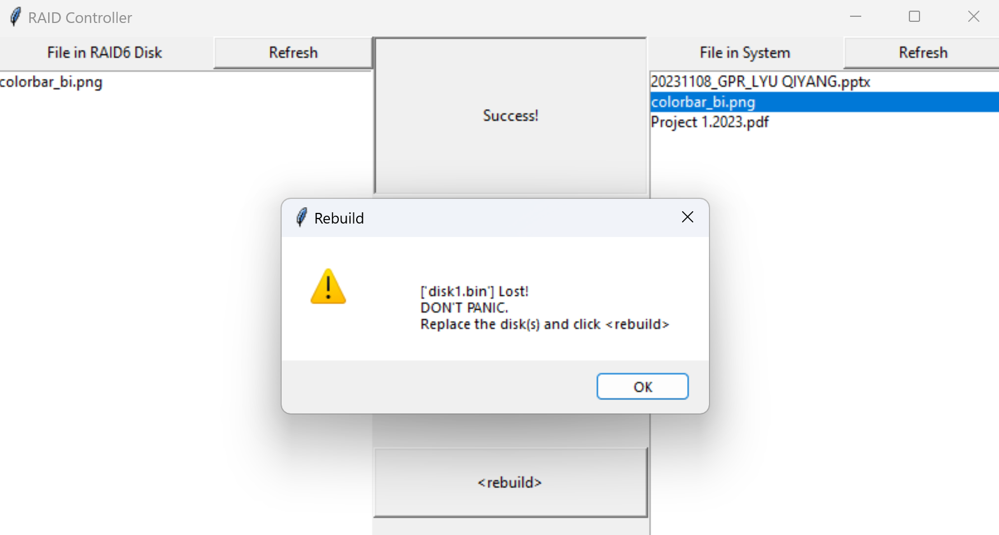
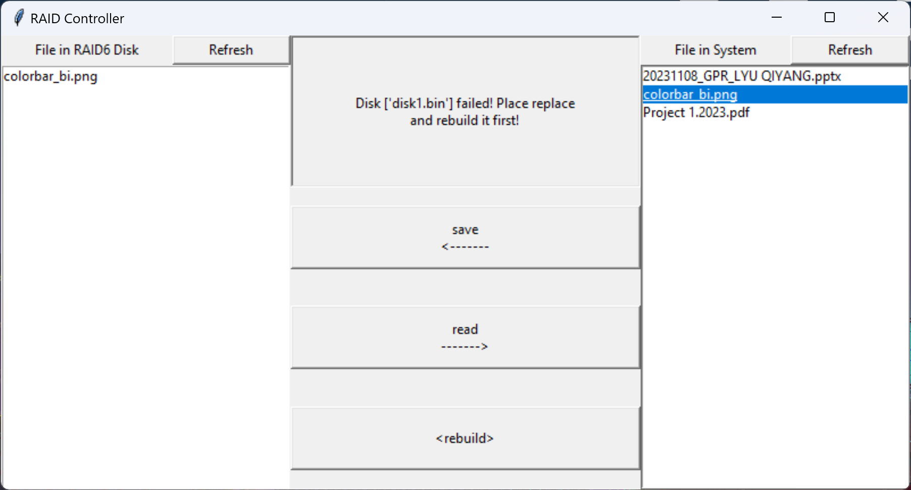

# RAID6 System

This repo provide a simulation of RAID6 storage system. It has the following features:
- User-friendly Graphic User Interface (GUI)
- Multi-processing parallel computing
- Customized system configurations
- Automatic disk health self-checking
- Safe data storage capability

## Preparation
Python >= 3.8 \
Install the packages listed in requirement.txt

## How to use

In the project folder, open **Hardware Simulator**:

        python3 GUI_simu.py

1. Create virtual hard disks
    - Click `Create Database`: Key in the number of virtual disks to create (K)
2. Configure RAID
    - Click `RAID Setting`: Key in Data_Disk_Num (n), Parity_Disk_Num (m), Encoder Word_Length (w)

Now the RAID system is ready to use.

In the project folder, open **RAID Controller**:

        python3 GUI_RAID6.py

3. Save a file
    - Copy file(s) that you want to save into `input_data` folder
    - Click File in System's `Refresh` button
    - Select the file(s) that you want to save (multiple selections allowed with `ctrl`)
    - Click `save` (if your file(s) are large, it may take a while)
    - Once complete, `Success!` will show in the middle

4. Read a file
    - Select the file(s) that you want to read (multiple selections allowed with `ctrl`)
    - Click `read` (if your file(s) are large, it may take a while)
    - Once complete, `Success!` will show in the middle
    - You can find your file in `output_data` folder

## Disk Fail And Restore Simulation
Open **Hardware Simulator** Again.

        python3 GUI_simu.py

1. Simulate a disk failure
    - Click `Remove Disk`: Key in the Disk ID (an integer) that you want to remove
    - If your **RAID Controller** is running, it will pop up disk failure warning immediately.
    

2. Replace the failed disk
    - Before you inserting a new disk, the system will change to Read-only Mode. Reading is allowed.
    
    - To rebuild the system, insert a new disk first
        - Click `Create Disk`: Key in the Disk ID you just removed

Open **RAID Controller** again

        python3 GUI_RAID6.py

3. Rebuild the database and Restore the data
    - click `rebuild` (If your database is large, it will take a looooooooog time!)
    - Once complete, `Success!` will show in the middle
    - You can perform read and write again

## Erase Database
It is possible if you want to erase the database and start again.

### [Caution] Once erase, all data will be removed (including the `output_data`) and database cannot be restored!)

Open **Hardware Simulator**

        python3 GUI_simu.py

- Click `Erase Database`